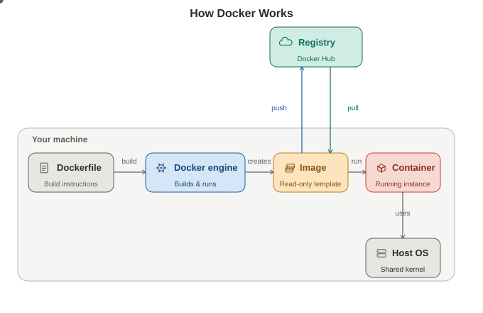

Flow diagram for Docker 

CMD - can be overriden 
Entry Point - We can't overriden
ARG --only works at one time and we can make that default value or we can change the as out requirment

### how we can check run containers
docker ps 

### how we can check all containers status all status
docker ps -a

#### How we can see docker images
docker images

### docker start
docker start <container id>

### how we can build the image 
docker run -d -p 8000:80 nginx

docker run = docker pull + docker create + docker run
-d 'running in backgroud i.e detach mode'
-p 'port able to access'
80 'nginx port number' it should be 80 beacause nginx runnig on port 80
8000 -this is host port not any port we can give
nginx 'image name'

#### how we can remove the container

docker rm <container id> --remove single the container  
docker rm -f <container id>  --- forceful way for removing the container
docker rm `docker ps -a -q`  ---this is for removing all the container at a time

### how we can remove the image

docker rmi <image id or image name>

### docker enabling 
systemctl enable docker

### docker start
systemctl start docker

### docekr status
systemctl status docker

### Install docker in REDHAT server
as super user or root user:

sudo dnf -y install dnf-plugins-core
sudo dnf config-manager --add-repo https://download.docker.com/linux/rhel/docker-ce.repo

sudo dnf install docker-ce docker-ce-cli containerd.io docker-buildx-plugin docker-compose-plugin

as root user run below commands as well
systemctl start docker
systemctl status docker
systemctl enable docker

### we need to come out from super or root user then run below commands

docker ps 

#### we neeed add teh user to docker group then only run docker commands

sudo usermod -aG docker ec2-user

then restart the server then we can run the docker commands 

### Docker instructions 
Dockerfile is build the custom images

FROM ---> is the Base OS for the Image
WORKDIR --> we can set the work directory move to that directory
COPY   --> it is copy the content form local only
ADD  --> it will copy the content from the external sources links
ENV --> we can use where ever we want
EXPose --> it will give the information oprt details, it is do nothing 
LABEL  --> filter the containers
ONBUILD  --> when we use the our image we can make some mandatory thing to be done like they 
             if someone use the our image they should have the indeac.html file first 
RUN ---> it will excute the command which we are providing

